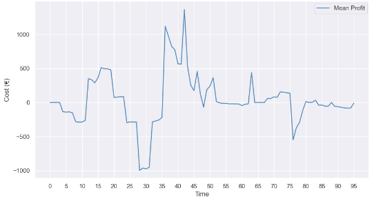
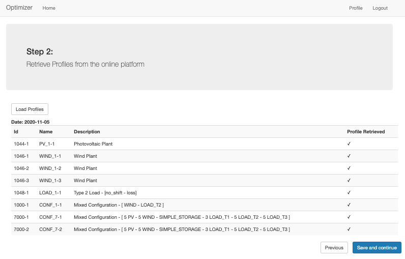

# VirtualPowerPlant-Simulator
Growing environmental awareness has led to a large growth in renewable energy technologies in recent years. The share of energy generation from renewable sources will increase dramatically in the coming years: therefore, it becomes more and more important to find effective solutions to better manage the generated energy. For this reason, and also thanks to technological progress, the concept of Virtual Power Plant is brought to life: an aggregation of decentralized generation, storage and consumption units coordinated by a central control system. The purpose of Virtual Power Plant is to resell in electricity markets, exploiting the flexibility of the aggregate of plants. 
The aim of this work was to create an intelligent resource management system that can be integrated into a VPP environment. This involves an optimization on two levels.
The first level deals with the local optimization of the distributed energy resources in the system. The second, aggregates local results and performs further optimization based on price fluctuations in the energy market.
Moreover, the model has been developed in order to be available as a web service and a dedicated application has been developed for ease of use.

Scaling of the model by number of PODs |  Scaling of sequential vs. parallel local optimizations by number of PODs
:-------------------------:|:-------------------------:
  |  


Aggregated Flexibility bound vs. Optimized Aggregted Flexibility bound |
:-------------------------:|
 |
 |
Mean Optimized Profit |
|


## Dependencies
- Pyomo
- Flask
- NumPy
- Matplotlib

## Installation
Clone this repository:
```
git clone https://github.com/ProjectsAI/VirtusAggregation.git
```
Move to the project's root folder VirtusAggregation and run:
```
pip3 install -r requirements.txt
```

## Running the program
The file main.py contains all the POD configurations used for tests.
Different configurations can be tested by changing the number of PODs in the proper section.
By runnig:
```
python main.py
``` 
Local and Aggregated optimizations and will be performed on the input PODs.

`VirtusAggregator/src` contains all the profile types and the implementation of the Local, and Aggregated optimizations, in particular:
LocalOptimization:
`pod.py` encapsulates the structure of a single count Point Of Delivery.
`pod_solver.py` is responsible for instantiating the model associated with the POD and resolving it.
`pod_model.py` encapsulates the Pyomo model used to optimize each POD

AggregatedOptimization:
`aggregator.py`  encapsulates the structure of the Aggregator.
`aggregator_solver.py`  is responsible for instantiating the model associated with the Aggregator and resolving it.
`aggregator_model.py`  encapsulates the Pyomo model used for the aggreagted optimization.

`api.py`  contains the APIs to make the optimizer available as a web service

## Running the webapp
`./WebAppOptimizer` contains the implementation of the web interface.

Before running the web application, make sure to activate the VPP-Simulator server:
```
python apis.py 
``` 

Open a new terminal, and execute:
```
redis-server 
``` 
to use Redis server as application cash (useful to overcome the 4kb limit for session data)

In a new terminal run
```
flask run 
``` 
to run the web application.
mizations by number of PODs





